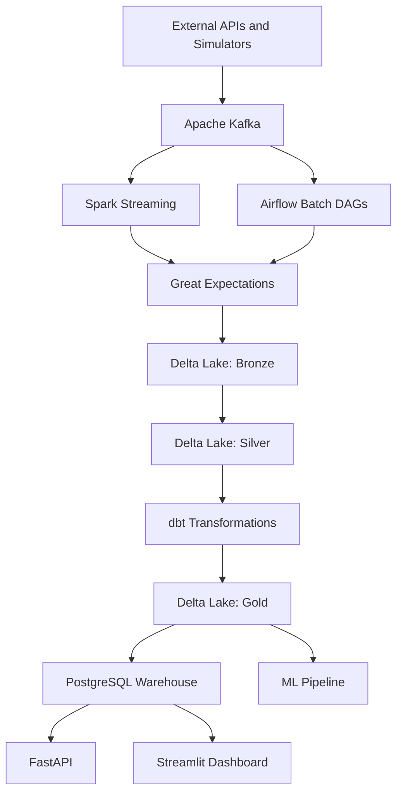

# Modern Data Platform Architecture

This project is an incremental, portfolio-grade data platform for real-time retail analytics. The current milestone includes Kafka producers, Spark Streaming into the Bronze Delta layer, Spark batch transformations into typed Silver Delta tables, dbt Gold marts, and Airflow orchestration.

## Local Services

| Service | Purpose | Local URL |
| --- | --- | --- |
| Kafka | Event backbone for producers and streaming jobs | `localhost:29092` |
| Kafka UI | Topic and message inspection | `http://localhost:8081` |
| PostgreSQL | Serving warehouse for marts and API queries | `localhost:5432` |
| MinIO | S3-compatible object storage for lakehouse data | `http://localhost:9001` |
| Spark Bronze | Kafka to Bronze Delta ingestion | Docker Compose profile `spark` |
| Spark Silver | Bronze to typed Silver Delta transformations | Docker Compose profile `spark` |
| Spark Thrift | Spark SQL endpoint for dbt | Docker Compose profile `dbt` |
| dbt | Gold analytics model build and tests | Docker Compose profile `dbt` |
| Airflow | Pipeline orchestration and scheduling | Docker Compose profile `airflow` |
| Airflow UI | DAG monitoring and manual triggers | `http://localhost:8080` |

## Event Topics

The `kafka-init` container creates these topics:

- `customers`
- `products`
- `orders`
- `payments`
- `clicks`
- `inventory`

## Lakehouse Layout

MinIO stores object data in the `lakehouse` bucket. Local directories mirror the intended Delta Lake layers for development notes, fixtures, and small samples:

- `data/bronze`
- `data/silver`
- `data/gold`

Phase 3 writes raw Kafka records to `data/bronze/events` as Delta files.
Phase 4 writes typed topic tables to `data/silver/customers`, `data/silver/products`, `data/silver/orders`, `data/silver/payments`, `data/silver/clicks`, and `data/silver/inventory`.
Phase 5 writes Gold analytics models to `data/gold`.
