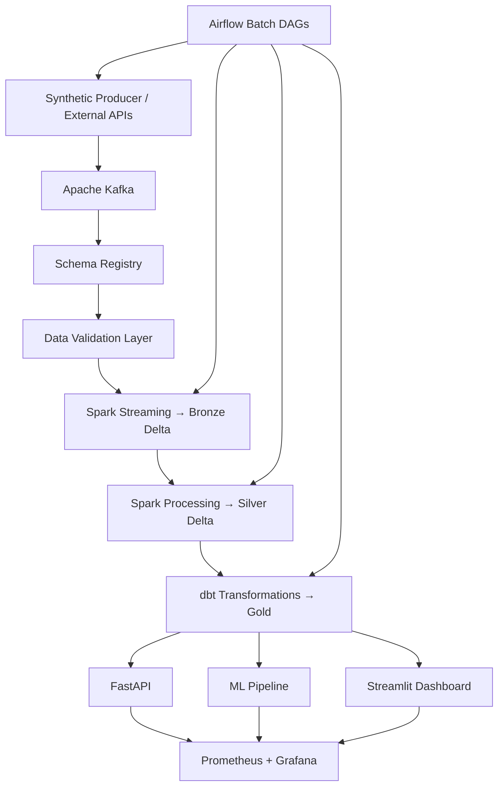

# Modern Data Platform Architecture

This project is an incremental, portfolio-grade data platform for real-time retail analytics.

**Current milestone:** Phases 1–6 complete. Phase 7 partially complete (post-layer GE validation). Phases 8–11 planned per the revised roadmap.

## Target Architecture



## Current Pipeline (Phases 1–6)

What runs today:

```text
produce_events → bronze_ingestion → validate_bronze → silver_transformation
  → validate_silver → dbt_gold_build → validate_gold
```

Validation currently runs **after** each Delta layer. Phase 7 will add schema registry and **pre-Bronze** contract enforcement at the Kafka boundary.

## Local Services (Today)

| Service | Purpose | Local URL |
| --- | --- | --- |
| Kafka | Event backbone for producers and streaming jobs | `localhost:29092` |
| Kafka UI | Topic and message inspection | `http://localhost:8081` |
| PostgreSQL | Warehouse metadata, Airflow backend | `localhost:5432` |
| MinIO | S3-compatible object storage | `http://localhost:9001` |
| Spark Bronze | Kafka to Bronze Delta ingestion | Docker Compose profile `spark` |
| Spark Silver | Bronze to typed Silver Delta | Docker Compose profile `spark` |
| Spark Thrift | Spark SQL endpoint for dbt | Docker Compose profile `dbt` |
| dbt | Gold analytics model build | Docker Compose profile `dbt` |
| Airflow | Pipeline orchestration | Docker Compose profile `airflow` |
| Airflow UI | DAG monitoring and triggers | `http://localhost:8080` |
| Great Expectations | Post-layer Delta validation | Docker Compose profile `ge` |
| Apicurio Schema Registry | JSON Schema contracts per topic | `http://localhost:8083` |
| Pre-Bronze validator | Contract checks + quarantine before Bronze write | Spark Bronze stream + Producer |

## Planned Services (Phases 8–11)

| Phase | Service | Purpose |
| --- | --- | --- |
| 8 | Prometheus | Metrics collection |
| 8 | Grafana | Dashboards (lag, freshness, failures) |
| 9 | FastAPI | REST endpoints over Gold marts |
| 9 | Streamlit | BI dashboard and KPIs |
| 10 | ML pipeline | Forecasting, churn, recommendations |
| 11 | CI/CD + integration tests | Production hardening |

## Event Topics

The `kafka-init` container creates these topics:

- `customers`
- `products`
- `orders`
- `payments`
- `clicks`
- `inventory`

## Lakehouse Layout

- `data/bronze/events` — raw Kafka records (Delta)
- `data/bronze/quarantine/events` — rejected records with `validation_errors`
- `data/silver/<topic>` — typed per-topic Silver tables
- `data/gold/` — dbt analytics marts
- `data/validations/` — Great Expectations result artifacts

## Data Contracts (Phase 7)

| Rule | Layer | Example |
| --- | --- | --- |
| `price > 0` | orders, products | Reject invalid pricing |
| `order_id` unique | orders | Dedup within micro-batch |
| `timestamp` not in future | all topics | Clock skew guard |
| Required fields | all topics | Enforced by JSON Schema + registry |

## Observability Metrics (Phase 8 Target)

| Metric | Why it matters |
| --- | --- |
| Kafka consumer lag | Ingestion backlog |
| Spark batch duration | Processing SLA |
| Data freshness | Stale mart detection |
| Failed records % | Contract violation rate |
