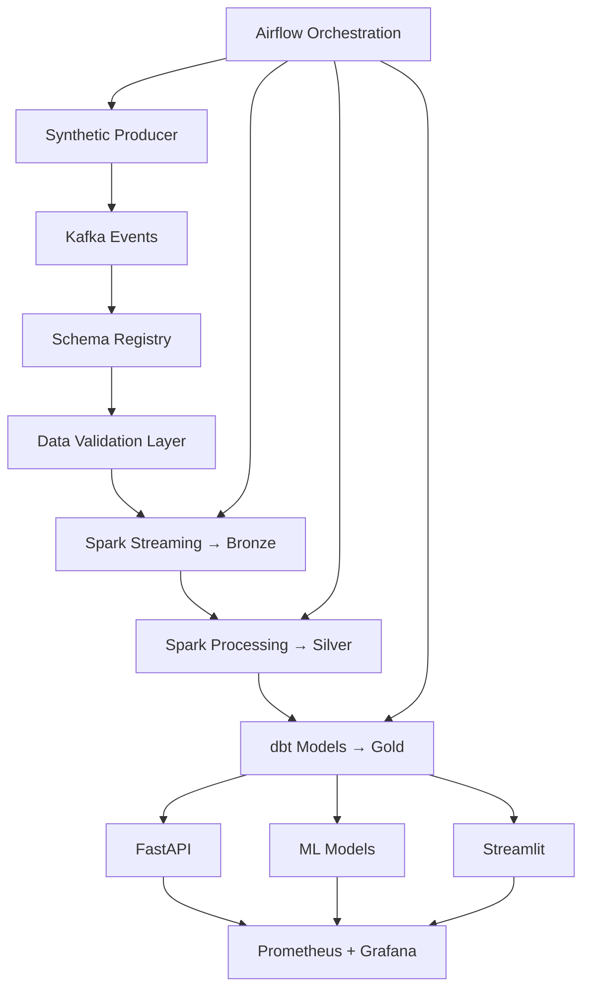

# Roadmap

Each phase should finish with working services, focused tests, and documentation.

## Current Status

| Phase | Goal | Status |
| --- | --- | --- |
| 1 | Project architecture, Docker Compose, PostgreSQL, MinIO, Kafka, Kafka UI | Done |
| 2 | Data generator and Kafka producers | Done |
| 3 | Spark Streaming to Bronze Delta Lake | Done |
| 4 | Spark transformations to Silver | Done |
| 5 | dbt models to Gold | Done |
| 6 | Airflow orchestration | Done |
| 7 | Data contracts + validation (schema registry, pre-Bronze checks) | Done |
| 8 | Observability layer (Prometheus, Grafana, pipeline metrics) | Done |
| 9 | Serving layer (FastAPI + Streamlit) | Done |
| 10 | ML layer (forecasting, churn, recommendations) | Planned |
| 11 | Production engineering (CI/CD, integration tests, schema versioning) | Planned |

## Phase Details

### Phases 1–6 (Done)

Core lakehouse pipeline:

```text
Producer → Kafka → Spark Bronze → Spark Silver → dbt Gold
```

Orchestrated end to end by Airflow (`retail_pipeline` DAG).

### Phase 7 — Data Contracts + Validation (Done)

| Component | Status |
| --- | --- |
| JSON Schema contracts per topic | Done |
| Apicurio schema registry | Done |
| Pre-Bronze validation + quarantine | Done |
| Producer-side contract checks | Done |
| Post-layer GE (Bronze, Silver, Gold) | Done |

See [phase-7-great-expectations.md](phase-7-great-expectations.md).

### Phase 8 — Observability Layer

Monitor pipeline health early:

| Metric | Source |
| --- | --- |
| Kafka consumer lag | Kafka / JMX exporter |
| Spark batch duration | Spark driver metrics |
| Data freshness | Last successful layer timestamp |
| Failed records % | Validation quarantine + GE results |

| Tool | Purpose |
| --- | --- |
| Prometheus | Metrics collection |
| Grafana | Dashboards and alerts |
| Airflow UI | DAG run history and task logs |
| Spark UI | Job stages and executor metrics |

See [phase-8-observability.md](phase-8-observability.md).

### Phase 9 — Serving Layer (API + BI)

Make Gold data usable:

**FastAPI**

- `GET /sales/daily`
- `GET /customers/top`
- `GET /products/trending`

**Streamlit**

- Revenue charts
- Live pipeline status
- KPI cards

See [phase-9-serving.md](phase-9-serving.md).

### Phase 10 — ML Layer

Models consuming Gold tables, writing predictions back to the warehouse:

| Model | Technique |
| --- | --- |
| Sales forecasting | Prophet or LSTM |
| Customer churn | XGBoost |
| Product recommendations | LightFM or two-tower |

### Phase 11 — Production Engineering

Senior-level platform hardening:

- CI/CD (GitHub Actions)
- Unit tests (`pytest`)
- Integration tests (end-to-end pipeline)
- Docker image optimization
- Environment configs (dev/staging/prod)
- Schema versioning and rollback strategy

## Target Architecture



## Migration Notes

The project originally planned 10 phases with Great Expectations as Phase 7 and observability as Phase 10. The revised plan:

1. Elevates **data contracts** to Phase 7 with pre-Bronze validation
2. Adds a dedicated **observability** phase (Phase 8) before serving
3. Splits serving, ML, and production engineering into Phases 9–11

Post-layer GE validation (already built) remains useful but becomes one layer of a broader contract strategy, not the primary gate.
